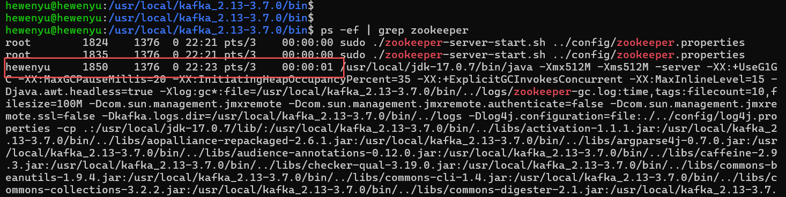
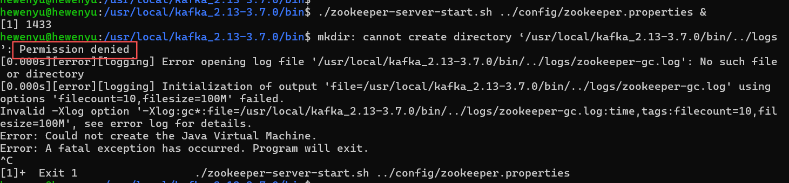
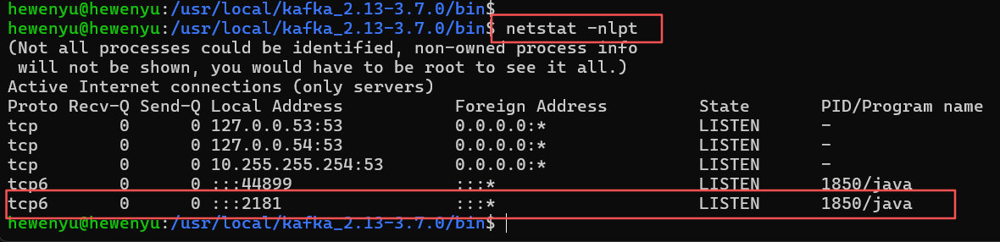
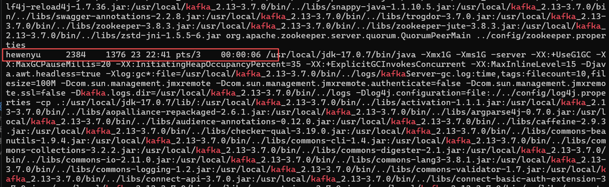
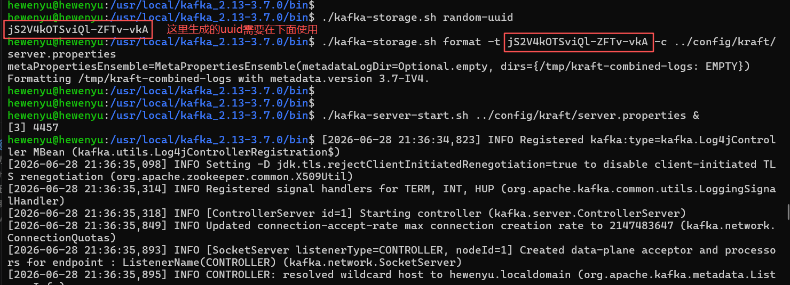
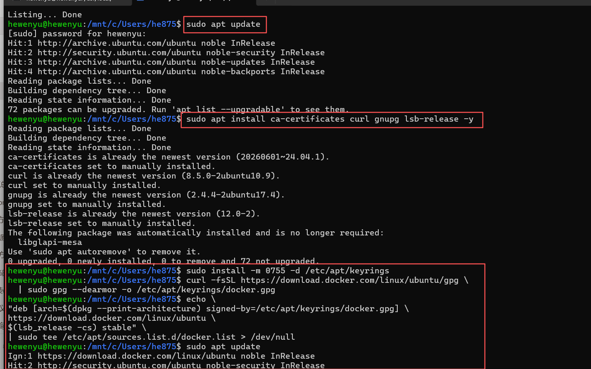

[toc]

# kafka


注意:

- git 项目使用 `git clone https://github.com/hewenyuAndroid/kafka.git` 命令下载项目时，会打包所有分支的文件，当前项目的 dev 分支文件比较大，需要跳过该分支

- 当前项目涉及的软件在 `dev` 分支

- 使用: `git clone --single-branch --branch master https://github.com/hewenyuAndroid/kafka.git` 命令，只 clone master 分支的代码，不影响拉取的速度

- 代码下载到本地后，`git fetch` 命令可以正常使用，但是不会同步 `dev` 分支;


> 如何拉取远程的 dev 分支

  
方案1:  把 dev 加进跟踪列表（推荐，规范）

```shell
# 1. 查看当前 remote 的 fetch 配置（应该只有 master）
git config --get remote.origin.fetch
# 输出类似：+refs/heads/master:refs/remotes/origin/master
  
# 2. 把 dev 也加进跟踪（不会覆盖 master，是追加）
git remote set-branches origin dev
  
# 3. 拉取 dev 的数据
git fetch origin dev
  
# 4. 切到 dev（本地建一个 tracking 分支）
git checkout dev
```

方案2:  "去 origin 拿 dev 的数据，回来在本地建一个也叫 dev 的分支并 track 它"。一步到位，但**不会**把 dev 加进 `remote.origin.fetch`的常驻跟踪列表，以后 `git fetch`（不带参数）还是只拉 master。

```sh
# 直接从远程 dev 拉下来，并在本地建 dev 分支，耗时操作
git fetch origin dev:dev
  
# 切过去
git checkout dev
```

## kafka 运行环境安装

当前虚拟机使用的是 wsl2

### jdk 配置

下载地址: https://www.oracle.com/java/technologies/downloads/#java17

```shell
# 解压 jdk 到指定目录
# 如果解压报错: tar: jdk-17.0.7/lib: Cannot mkdir: No such file or directory
# 则需要使用 sudo 的 root 权限
tar -zxvf jdk-17_linux-x64_bin.tar.gz -C /usr/local

# 配置 jdk 环境变量
# step1: 打开环境变量配置文件
sudo nano /etc/profile
# step2: 添加环境变量配置
export JAVA_HOME=/usr/local/jdk-17.0.7
export PATH=$JAVA_HOME/bin:$PATH
export CLASSPATH=.:$JAVA_HOME/lib/
# step3: 刷新环境变量
source /etc/profile
```

```shell
# 验证 wsl 的java环境
hewenyu@hewenyu:/usr/local/jdk-17.0.7$ source /etc/profile
hewenyu@hewenyu:/usr/local/jdk-17.0.7$ java -version
java version "17.0.7" 2023-04-18 LTS
Java(TM) SE Runtime Environment (build 17.0.7+8-LTS-224)
Java HotSpot(TM) 64-Bit Server VM (build 17.0.7+8-LTS-224, mixed mode, sharing)
```


### kafka 配置

下载地址: https://kafka.apache.org/downloads

```shell
# 安装 kafka
# 如果解压失败，使用 sudo 添加 root 权限
tar -xzf kafka_2.13-3.7.0.tgz -C /usr/local/
cd kafka_2.13-3.7.0
```

解压后得到的 kafka 目录如下
```shell
hewenyu@hewenyu:/usr/local/kafka_2.13-3.7.0$ pwd
/usr/local/kafka_2.13-3.7.0
hewenyu@hewenyu:/usr/local/kafka_2.13-3.7.0$ ls -la
total 80
drwxr-xr-x  7 root root  4096 Feb  9  2024 .
drwxr-xr-x 12 root root  4096 Jun 27 01:13 ..
-rw-r--r--  1 root root 15125 Feb  9  2024 LICENSE
-rw-r--r--  1 root root 28359 Feb  9  2024 NOTICE
drwxr-xr-x  3 root root  4096 Feb  9  2024 bin
drwxr-xr-x  3 root root  4096 Feb  9  2024 config
drwxr-xr-x  2 root root 12288 Jun 27 01:13 libs
drwxr-xr-x  2 root root  4096 Feb  9  2024 licenses
drwxr-xr-x  2 root root  4096 Feb  9  2024 site-docs
```

## 启动运行 kafka

启动运行 kafka 环境时，需要本地安装了 `jdk1.8+`；

`Apache Kafka` 可以使用 `Zookeeper` 或 `KRaft` 启动，启动只能选择其中的一种，不能两种同时使用。

`KRaft` 为 `Apache Kafka` 内置的共识机制，用于取代 `Apache Zookeeper`；

### 使用 `Apache Zookeeper` 启动 `kafka`

`Kafka 3.0+` 内置了 `Zookeeper`

```shell
hewenyu@hewenyu:/usr/local/kafka_2.13-3.7.0/bin$ pwd
/usr/local/kafka_2.13-3.7.0/bin
hewenyu@hewenyu:/usr/local/kafka_2.13-3.7.0/bin$ ls | grep zoo
zookeeper-security-migration.sh
# zookeeper 启动脚本
zookeeper-server-start.sh
# zookeeper 关闭脚本
zookeeper-server-stop.sh
zookeeper-shell.sh


hewenyu@hewenyu:/usr/local/kafka_2.13-3.7.0/config$ pwd
/usr/local/kafka_2.13-3.7.0/config
hewenyu@hewenyu:/usr/local/kafka_2.13-3.7.0/config$ ls | grep zoo
# zookeeper 配置文件
zookeeper.properties
```

#### 1、启动 `Zookeeper`

```shell
# 将 zookeeper 服务在后台启动
./zookeeper-server-start.sh ../config/zookeeper.properties &
```

`&` 是 `shell` 的后台运行符号，作用如下:

- 让命令在子 `Shell` 中异步执行：`Shell` 会 `fork` 出一个子进程来运行该命令，然后立即返回提示符，不等待命令执行完毕。
- 不阻塞终端：你可以在同一个终端继续输入其他命令，而 `ZooKeeper` 服务会在后台默默运行。
- 标准输出/错误仍会打印到当前终端（除非重定向），但你可以继续做其他事。



启动 `zookeeper` 报权限错误时，可以修改当前用户的目录权限:

```shell
sudo chown -R hewenyu:hewenyu /usr/local/kafka_2.13-3.7.0/
```



zookeeper 启动的默认端口号是 `2181`，可以在 `config/zookeeper.properties` 配置文件中设置

```shell
...
# zookeeper 启动的端口号
clientPort=2181
...
```



#### 2、启动 `kafka`

```shell
# kafka 同样在后台云运行
./kafka-server-start.sh ../config/server.properties &
```

同样可以使用 `ps -ef | grep kafka` 查看 是否启动了 `kafka` 服务



#### 3、关闭 `kafka`

```shell
./kafka-server-stop.sh ../config/server.properties
```

关闭成功后，可以看到上面的 kafka 进程 (`pid:2384`) 已经没有了;


#### 4、关闭 `zookeeper`

```shell
./zookeeper-server-stop.sh ../config/zookeeper.properties
```

关闭 `zookeeper` 后，可以看到 `zookeeper` 进程 (`pid:1850`) 已经没有了


### 使用 `KRaft` 启动 `kafka`

#### 1、生成 `Cluster UUID` (集群UUID)

```shell
./kafka-storage.sh random-uuid
```

#### 2、格式化日志目录

```shell
# 注意，这里 -t 后面的 uuid 是上面 生成的
./kafka-storage.sh format -t Vej9AIzrTG2fHUAcq8WnCA -c ../config/kraft/server.properties
```



#### 3、启动 `kafka`

```shell
./kafka-server-start.sh ../config/kraft/server.properties &
```

#### 4、关闭 `kafka`

```shell
./kafka-server-stop.sh ../config/kraft/server.properties
```


## `Ubuntu` 安装 `Docker`


### 1、如果有旧版本，卸载旧版本

```shell
sudo apt remove docker docker-engine docker.io containerd runc -y
sudo apt autoremove -y
```

### 2、安装 `Docker`

#### 2.1 安装依赖并添加 Docker 官方 APT 源

```shell
# 安装基础工具
sudo apt update
sudo apt install ca-certificates curl gnupg lsb-release -y

# 创建 keyrings 目录
sudo install -m 0755 -d /etc/apt/keyrings

# 导入 Docker 官方 GPG 密钥
curl -fsSL https://download.docker.com/linux/ubuntu/gpg \
  | sudo gpg --dearmor -o /etc/apt/keyrings/docker.gpg

# 添加 Docker 稳定版仓库
echo \
"deb [arch=$(dpkg --print-architecture) signed-by=/etc/apt/keyrings/docker.gpg] \
https://download.docker.com/linux/ubuntu \
$(lsb_release -cs) stable" \
| sudo tee /etc/apt/sources.list.d/docker.list > /dev/null

# 更新索引
sudo apt update
```



#### 2.2 查看可用版本

```shell
apt-cache madison docker-ce

# 命令执行结果如下
hewenyu@hewenyu:/mnt/c/Users/he875$ apt-cache madison docker-ce
 docker-ce | 5:29.6.1-1~ubuntu.24.04~noble | https://download.docker.com/linux/ubuntu noble/stable amd64 Packages
 docker-ce | 5:29.6.0-1~ubuntu.24.04~noble | https://download.docker.com/linux/ubuntu noble/stable amd64 Packages
 docker-ce | 5:29.5.3-1~ubuntu.24.04~noble | https://download.docker.com/linux/ubuntu noble/stable amd64 Packages
 docker-ce | 5:29.5.2-1~ubuntu.24.04~noble | https://download.docker.com/linux/ubuntu noble/stable amd64 Packages
 .....
 docker-ce | 5:26.0.2-1~ubuntu.24.04~noble | https://download.docker.com/linux/ubuntu noble/stable amd64 Packages
 docker-ce | 5:26.0.1-1~ubuntu.24.04~noble | https://download.docker.com/linux/ubuntu noble/stable amd64 Packages
 docker-ce | 5:26.0.0-1~ubuntu.24.04~noble | https://download.docker.com/linux/ubuntu noble/stable amd64 Packages
```

或使用如下命令

```shell
apt list -a docker-ce

# 命令执行结果如下
hewenyu@hewenyu:/mnt/c/Users/he875$ apt list -a docker-ce
Listing... Done
docker-ce/noble 5:29.6.1-1~ubuntu.24.04~noble amd64
docker-ce/noble 5:29.6.0-1~ubuntu.24.04~noble amd64
docker-ce/noble 5:29.5.3-1~ubuntu.24.04~noble amd64
....
docker-ce/noble 5:26.1.4-1~ubuntu.24.04~noble amd64
docker-ce/noble 5:26.1.3-1~ubuntu.24.04~noble amd64
docker-ce/noble 5:26.1.2-1~ubuntu.24.04~noble amd64
docker-ce/noble 5:26.1.1-1~ubuntu.24.04~noble amd64
docker-ce/noble 5:26.1.0-1~ubuntu.24.04~noble amd64
docker-ce/noble 5:26.0.2-1~ubuntu.24.04~noble amd64
docker-ce/noble 5:26.0.1-1~ubuntu.24.04~noble amd64
docker-ce/noble 5:26.0.0-1~ubuntu.24.04~noble amd64
```

#### 2.3 安装指定版本 Docker CE

注意: `docker-ce` 和 `docker-ce-cli` 必须指定同一完整版本字符串，其余组件不锁版本取兼容最新即可。

```shell
# 将 <VERSION_STRING>替换为 2.2 中查到的版本
sudo apt install -y \
  docker-ce=<VERSION_STRING> \
  docker-ce-cli=<VERSION_STRING> \
  containerd.io \
  docker-buildx-plugin \
  docker-compose-plugin


# 例如，使用 26.1.4 版本
sudo apt install -y \
  docker-ce=5:26.1.4-1~ubuntu.24.04~noble \
  docker-ce-cli=5:26.1.4-1~ubuntu.24.04~noble \
  containerd.io \
  docker-buildx-plugin \
  docker-compose-plugin
```


#### 2.4 查看 Docker 版本

```shell
hewenyu@hewenyu:/mnt/c/Users/he875$ docker --version
Docker version 26.1.4, build 5650f9b

# 或
hewenyu@hewenyu:/mnt/c/Users/he875$ docker -v
Docker version 26.1.4, build 5650f9b
```

#### 2.5 启动 docker 验证

```shell
sudo systemctl enable docker
sudo systemctl start docker
docker version
sudo docker run hello-world
```

#### 2.6 锁定版本防止 apt upgrade 自动升级（可选）

```shell
sudo apt-mark hold docker-ce docker-ce-cli

# 取消锁定
sudo apt-mark unhold docker-ce docker-ce-cli
```
